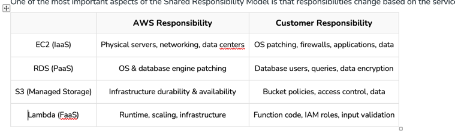

AWS Shared Responsibility Model
Last Updated : 4 Feb, 2026
•
•
•
The AWS Shared Responsibility Model defines how security responsibilities are divided between AWS and its customers. AWS secures the underlying cloud infrastructure, while customers are responsible for securing what they run in the cloud.
•	Security is a shared effort between AWS and the customers using it.
•	It encourages customers to actively manage access, data, and configurations.
•	Responsibility boundaries vary depending on the AWS service model (IaaS, PaaS, SaaS).
AWS Responsibility
•	AWS is responsible for securing the underlying cloud infrastructure, including physical data centers, server hardware, and global networking components.
•	It enforces strong physical and environmental security controls such as access restrictions, surveillance, and hardware protection to maintain infrastructure integrity.
•	AWS adheres to global compliance standards and undergoes regular third-party audits to meet security and regulatory requirements.
•	For managed services like Amazon RDS and Amazon S3, AWS secures the service infrastructure and provides built-in security features, while customers manage access and data protection.
Customer Responsibility
•	Customers are responsible for securing everything they run in the cloud, including their data, applications, and access configurations.
•	They must protect sensitive data by configuring encryption for data at rest and in transit, using AWS-provided tools according to their security requirements.
•	Customers are responsible for managing identities and permissions through proper IAM configuration, ensuring only authorized users and services can access AWS resources.
•	Securing applications and resource configurations is also the customer’s responsibility, including safe application design, controlling network exposure, and regularly reviewing security settings.
Real-World Example: S3 Data Exposure
If an Amazon S3 bucket is accidentally made public and sensitive data is exposed:
•	AWS did not fail
•	The infrastructure was secure
•	The customer misconfigured access policies
This clearly illustrates security in the cloud versus security of the cloud.
Collaborative Security:
•	The AWS Shared Responsibility Model clearly defines security responsibilities between AWS and customers.
•	This shared approach promotes collaboration, trust, and transparency in securing cloud environments.
•	AWS secures the underlying cloud infrastructure, while customers secure their data, applications, and configurations.
•	By embracing this model, organizations can enhance security, reduce risks, and fully leverage cloud benefits.

Responsibility by AWS Service Type
One of the most important aspects of the Shared Responsibility Model is that responsibilities change based on the service used.

